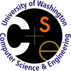

{: height=250 width=250 style="float: right; margin: 10px;"}

# Course description

This course will teach students how to reason about, design, and implement programs that run on parallel machines. We will cover a variety of parallel programming models, parallel algorithms, and styles of parallelism. We will also discuss specific parallel languages and frameworks, including frameworks designed for big data analytics.

{: height=144 width=123 style="float: right; margin: 10px;"}

We will be gaining practical parallel programming experience using a ~900-core cluster cluster of Xeon Phi processors. Thanks to the Intel University Program Office for their generous donation of hardware and support in developing this course. As part of this program, we'll be making all the course materials we develop available for others to use [at this link](resources).

# Course info 

## Staff
* Instructor: Jacob Nelson
* TAs: TBD.
* Course staff mailing list: [csep524-staff@cs.washington.edu](csep524-staff@cs.washington.edu)

## Meeting times
* Lectures: TBD
* Office hours by appointment

## Staying in touch
* Course mailing list: [csep524_TBD@uw.edu](csep524_TBD@uw.edu) (everyone in the class including staff).
* Class discussion board: [https://catalyst.uw.edu/gopost/board/TBD](https://catalyst.uw.edu/gopost/board/TBD)

## Textbook
Lin & Snyder, [Principles of Parallel Programming](http://www.pearsonhighered.com/educator/academic/product/0,3110,0321487907,00.html)
* 2nd printing: preferable due to bug fixes
* 1st printing: [Errata available here](http://www.cs.utexas.edu/~lin/errata.html)

# Grading

We'll have three types of assignments in this class. First, we'll ask you to write commentary on papers that we read. Second, we'll have a number of programming assignments to acquaint you with basic issues around memory locality and parallelism needed for high performance.

Finally, much of the grade will be based on a final project, in which you are encouraged to work in small teams. This could involve parallelizing an interesting application, or developing or evaluating a novel parallel computing tool. We'll provide suggestions of possible projects as the class proceeds.

Breakdown of grade:
* Reading commentary assignments: 33% of grade
* Homework: 25% of grade
* Final project: 50% of grade

Submit assignments to the [Catalyst dropbox](TBD).

Late day policy: You have 5 late days, where weekends counts as 1 late day. Past that, each day costs 10% of the assignment’s grade, a bargain! :-)

# Schedule

This is the planned lecture schedule. It will get filled in as we go, so please check back on a regular basis.

Each week there will be several readings, including some textbook chapters and influential research papers. Some readings will be marked (required), while the rest are suggested, but highly recommended. In addition, a few of the research papers will require an additional commentary as a homework assignment (bolded). The commentary should be a paragraph describing what you found most interesting or surprising, or asking questions that you have. These commentaries should be submitted to the Catalyst dropbox by the due date given on Catalyst.

Lectures are recorded, and will be available [here](http://courses.cs.washington.edu/courses/csep524/16fa/video) a few days after the lecture whenever possible.

<table style="width:100%" rules="rows">
    <tr>
        <th>Date</ht>
        <th>Topic and Reading</th>
        <th>Assignments</th>
    </tr>
    
     <tr>
         <td valign="top">{{ week.date }}</td>
         <td valign="top">{{ week.topics | markdownify }}</td>
         <td valign="top">{{ week.assignments | markdownify }}</td>
     </tr>
    
</table>

